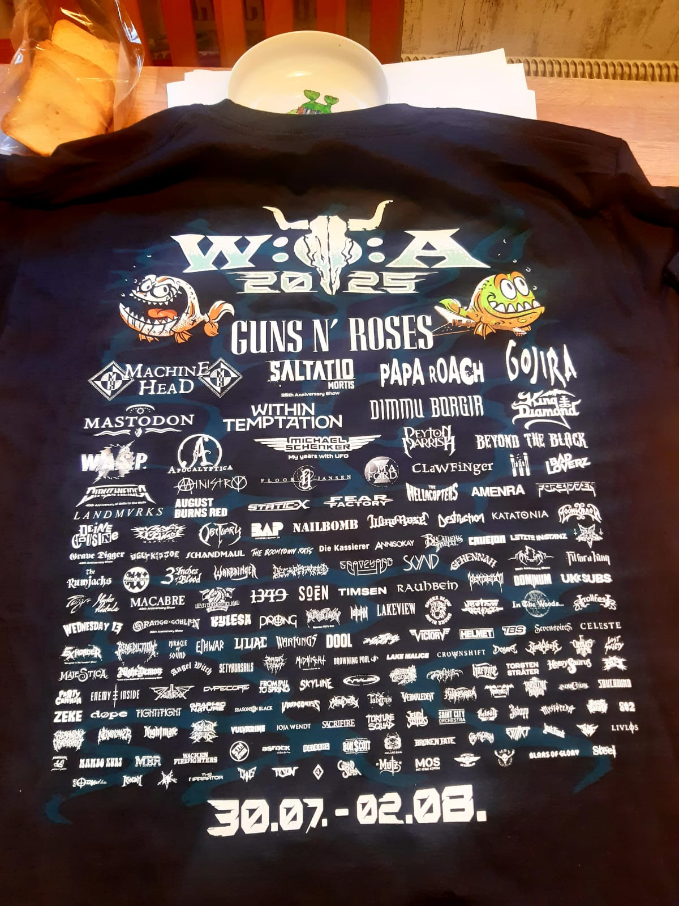

## Shuttlebus

Es gibt zum WOA 2025 wieder einen Shuttle Bus von Montag bis Samstag, jeweils zwischen 10 und 18:30.
Der Shuttle startet vom [Festival Bus Stop](https://maps.app.goo.gl/UWz5M6ubptoVko286) an der Ecke Bokelrehmer Straße / Vierthweg (Bokelrehmer Weg).

Zusätzlich zum Schwimmbad gibt es dieses Jahr eine Haltestelle an der [LGH Clubstage](https://maps.app.goo.gl/ttYHz65VsXD3niVP6) (Landgasthof).

Der Bus kostet 2€ pro Fahrt, der Eintritt im Schwimmbad 3€.

## Bezahlung

**Im Schwimmbad und Bus kann nur bar bezahlt werden.**

## Schwimmbad 2025 T-Shirt

Im Schwimmbad ist dieses Jahr außerdem exclusiv das T-Shirt mit der Schildkröte erhältlich!
Nur solange der Vorrat reicht.

